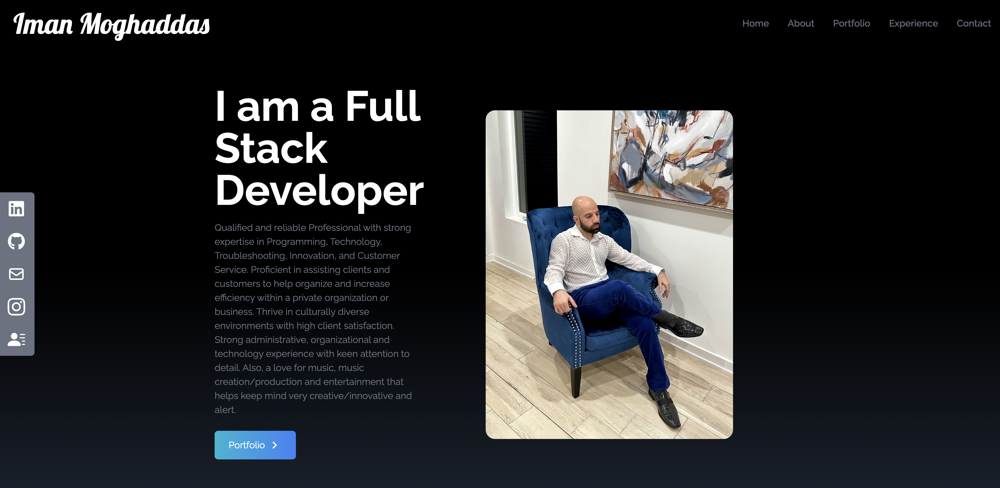
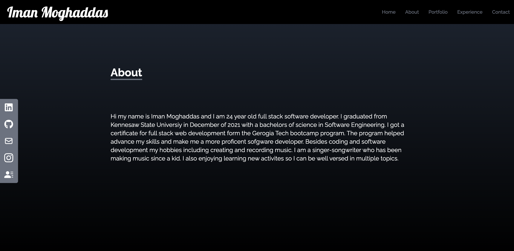
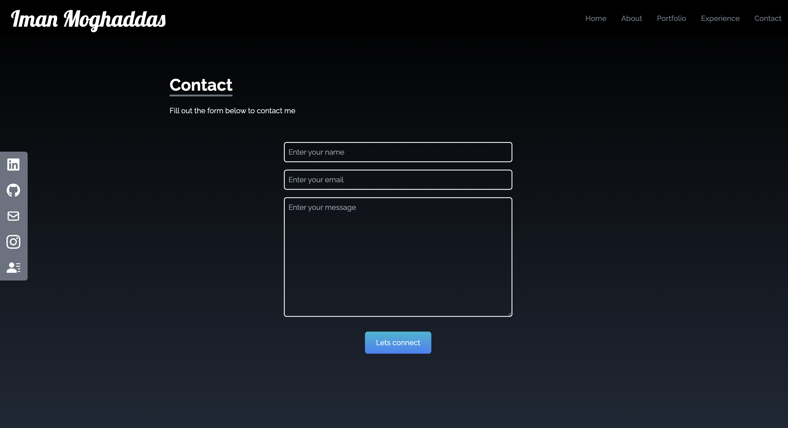
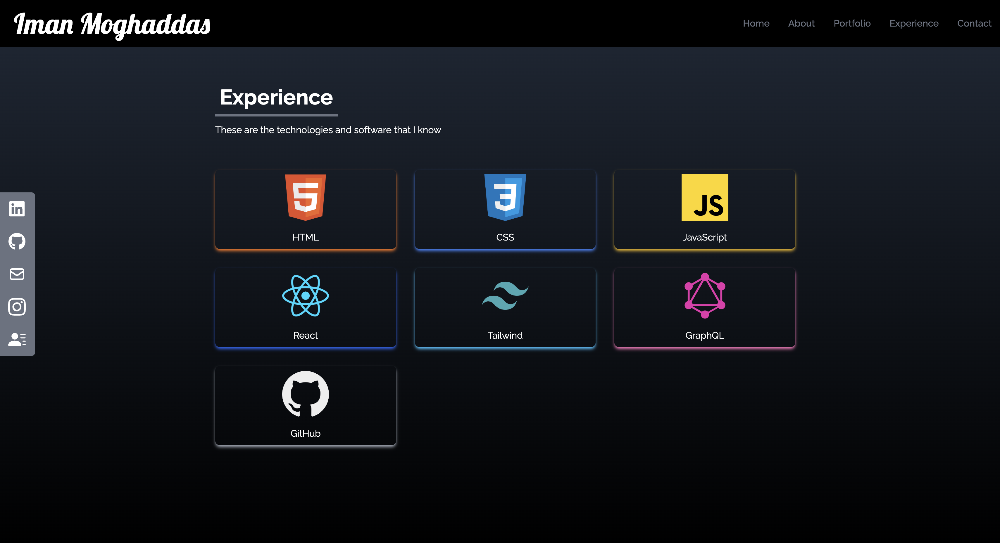
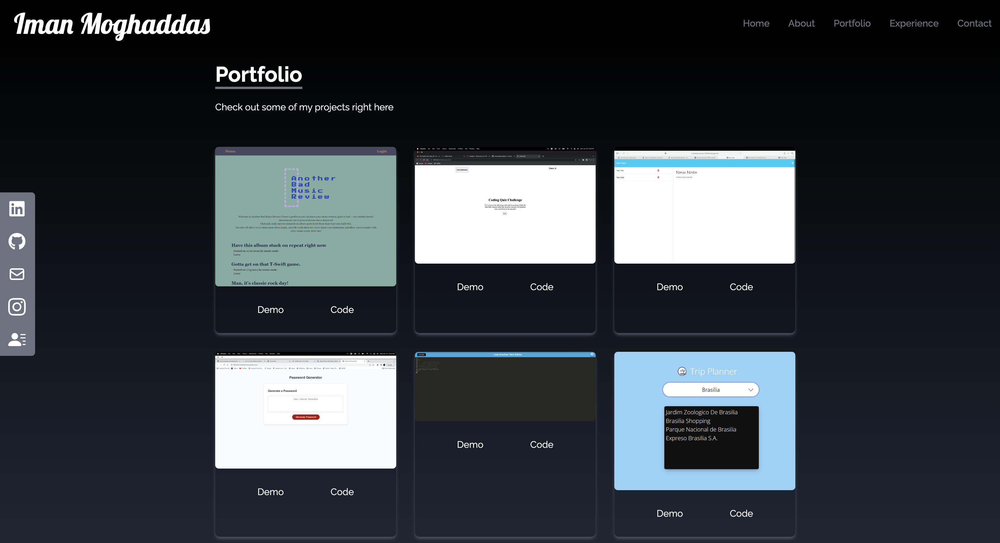

# React Portfolio
A portfolio that uses react to show off my projects and resume

## Description
A react portfolio for developer/designers. It is used to showcase my work, projects and other information to potential clients or employers. This portfolio uses react with tailwind and showcases my full-stack projects. It contains an about, portfolio section, experience secion, a downloadable pdf, and a contact secton with a form to submit that i will receive.

## Table of Contents
   - [Installation](#installation)
   - [Usage](#usage)
   - [Deployment](#deployment)
   - [Screenshot](#screenshot)
   - [Features](#features)
   - [Technologies](#technologies)
   - [License](#license)
   - [Credits](#credits)
   - [Contribution](#contributions)
   - [Contact](#contact)

## Installation
To install simply clone the repo down to your local machine. In the CLI in the relative directory, run 'npm i' to get all dependancies required for sucessful download of packages.

## Usage
To use the package as a consumer, simply visit the deployed link and use the navigation bar to see different pages. On the links to the side, click 'Resume' and it will download a PDF of my resume to your computer. On the contact section, simply fill out the form - meeting all requirements - and click 'Send Message.'

To use the package as a Developer, after following the installation steps above, at the root of the project directory run command 'npm start' in your CLI, then click the link in the CLI to view site from localhost. Be sure you're also set up to run a react app if you want to create your own. Remember to set up a Getform.io to collect contact information!

## Deployment
Live URL: https://imanmogh.github.io/reactPortfolio/

## Screenshot

## Features
Getform, GitHub Pages Deploy

## Technologies
JavaScript, HTML, CSS, Node.js, React, Tailwind

## License
This project is licensed under the MIT license. For more information about this license and what it entails, visit the MIT website here

Preview:

Permission is hereby granted, free of charge, to any person obtaining a copy of this software and associated documentation files (the “Software”), to deal in the Software without restriction, including without limitation the rights to use, copy, modify, merge, publish, distribute, sublicense, and/or sell copies of the Software, and to permit persons to whom the Software is furnished to do so, subject to the following conditions:

The above copyright notice and this permission notice shall be included in all copies or substantial portions of the Software.

THE SOFTWARE IS PROVIDED “AS IS”, WITHOUT WARRANTY OF ANY KIND, EXPRESS OR IMPLIED, INCLUDING BUT NOT LIMITED TO THE WARRANTIES OF MERCHANTABILITY, FITNESS FOR A PARTICULAR PURPOSE AND NONINFRINGEMENT. IN NO EVENT SHALL THE AUTHORS OR COPYRIGHT HOLDERS BE LIABLE FOR ANY CLAIM, DAMAGES OR OTHER LIABILITY, WHETHER IN AN ACTION OF CONTRACT, TORT OR OTHERWISE, ARISING FROM, OUT OF OR IN CONNECTION WITH THE SOFTWARE OR THE USE OR OTHER DEALINGS IN THE SOFTWARE.

## Credits

## How to Contribute
Fork the repo and clone down to your local machine. Once you have the latest version of the repo, you can add or make changes then submit a pull request for your changes. Please use best practices as well as proper naming conventions and comments depicting what the code segements function is. Finally in the body of your pull request, please explain why these changes you were necissary and if it is a bug what steps can be completed to reproduce this bug. If these guidelines are not met, pull requests will not be reviewed or accepted.

## Contact
If you liked this project check out my other repos here.
For any questions or inquiries, you can contact me at imanmoghaddas@yahoo.com.

Iman Moghaddas: Full-Stack Developer